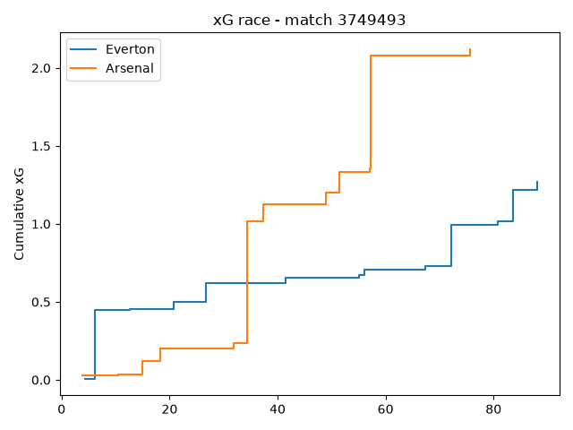
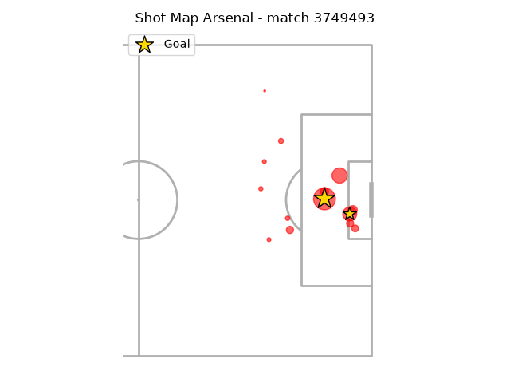
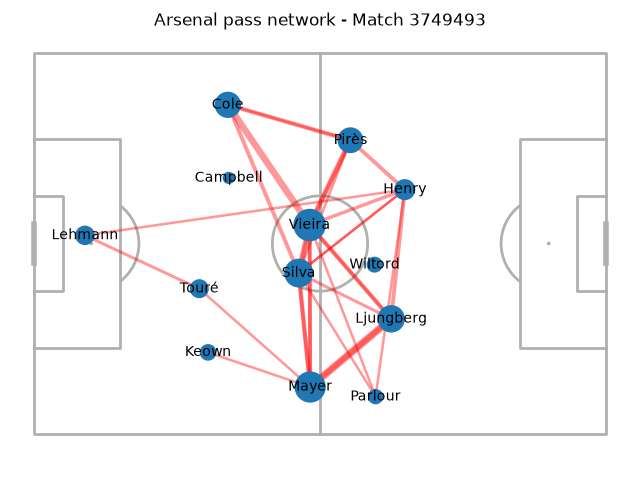
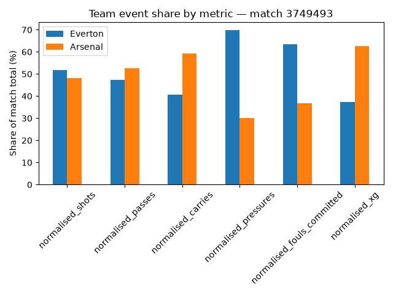

# Football Match Analytics Report Generator

A Python football analytics project that transforms StatsBomb open event data into match reports, CSV datasets, SQL analysis and football visualisations.

## Features

### Match analysis
- Final score calculation, including own goals
- Team event statistics
- Shot and expected-goals analysis
- Player involvement rankings
- Official score validation

### Visualisations
- Expected-goals race
- Shot maps
- Pass networks
- Team event-share comparison

### Data outputs
- Team statistics
- Shot summaries
- Player statistics
- Pass-network nodes and edges
- SQL analysis tables

### SQL analysis
- Shooting efficiency
- xG finishing performance
- Possession-style metrics
- Player attacking contribution
- Match-level goals and xG comparisons

## Why I built this

I built this project to develop practical experience with Python, Pandas, SQL, data visualisation and modular software design using real football event data.

The project converts raw StatsBomb events into readable match reports and visual analytics resembling the information found in football analytics platforms.

## Example visualisations

### Expected-goals race



### Shot map



### Pass network



### Normalised Stats by team


## Installation

Clone the repository:

```bash
git clone <repository-url>
cd <repository-name>
```

Create and activate a virtual environment:

```bash
python -m venv .venv
```

On Windows:

```bash
.venv\Scripts\activate
```

Install the dependencies:

```bash
pip install -r requirements.txt
```

## Running the project

Select a StatsBomb match ID in `main.py`, then run:

```bash
python src/main.py
```

The program:

1. Loads the match events and line-ups.
2. Generates the match report.
3. Calculates team, player, shot and xG statistics.
4. Exports the tabular outputs as CSV files.
5. Generates the selected visualisations as PNG files.

## Example report

```text
Match: Everton 1-2 Arsenal

Basic stats: 
Everton:
- Shots: 15
- Goals: 1
- XG: 1.27
- Passes: 381
- Carries: 235
- Pressures: 271
- Fouls Committed: 19

Arsenal:
- Shots: 14
- Goals: 2
- XG: 2.12
- Passes: 422
- Carries: 342
- Pressures: 117
- Fouls Committed: 11

Top players:
                     player  events
            Thomas Gravesen     248
             Patrick Vieira     230
Gilberto Aparecido da Silva     178
              Thierry Henry     178
 Laureano Bisan-Etame Mayer     165

Top XG shots:
          player    team  minute  shot_statsbomb_xg shot_outcome
   Thierry Henry Arsenal      34           0.783500         Goal
   Nick Chadwick Everton       6           0.421668        Saved
  Patrick Vieira Arsenal      57           0.378841        Saved
    Robert Pirès Arsenal      57           0.319439         Goal
Tomasz Radziński Everton      83           0.200138         Goal

Top Players by attacking stats:
                     player    team  Carry  Dribble  Pass  Shot  total_attacking_stats
             Patrick Vieira Arsenal     52        5    62     3                    122
            Thomas Gravesen Everton     50        3    58     2                    113
 Laureano Bisan-Etame Mayer Arsenal     42        2    52     0                     96
         Alessandro Pistone Everton     33        1    55     0                     89
               Robert Pirès Arsenal     40        6    39     3                     88
Gilberto Aparecido da Silva Arsenal     39        0    49     0                     88
          Fredrik Ljungberg Arsenal     38        5    39     1                     83
              Thierry Henry Arsenal     35        7    29     4                     75
                Ashley Cole Arsenal     26        3    37     0                     66
             David Unsworth Everton     21        0    39     0                     60

Shot Summary:
Everton:
- Total Shots: 15
- XG: 1.27
- Goals: 1
- Shots On Target: 5
- Shots Off Target: 5
- Shots Blocked: 5

Arsenal: 
- Total Shots: 14
- XG: 2.12
- Goals: 2
- Shots On Target: 4
- Shots Off Target: 6
- Shots Blocked: 3
```

## Running the SQL analysis

After generating the required CSV outputs, run:

```bash
python src/sql_analysis.py
```

The SQL outputs are saved under:

```text
outputs/sql_analysis/
```

They include shooting-efficiency, xG-finishing, possession-style, player-contribution and match-summary tables.

## Project structure

```text
.
Football_match_analytics/
├── docs/
│   └── images/
│       ├── normalised_stats_by_team.png
│       ├── pass_network.png
│       ├── shot_map.png
│       └── xg_race.png
├── src/
│   ├── analytics.py
│   ├── main.py
│   ├── match_report.py
│   ├── sql_analysis.py
│   └── visualisations.py
├── .gitattributes
├── .gitignore
├── README.md
└── requirements.txt
```

## Current limitations

- The project analyses one match at a time.
- The SQL analysis still relies on previously exported CSV files.
- Some SQL inputs currently use fixed filenames.
- The analysis is limited to competitions available through StatsBomb open data.
- The project does not yet provide an interactive user interface.

## Planned improvements

- Generalise the SQL pipeline for arbitrary match IDs.
- Support analysis across multiple matches.
- Add automated tests for core analytics functions.
- Build an interactive dashboard.

## Data source

Match event data is provided through StatsBomb Open Data.